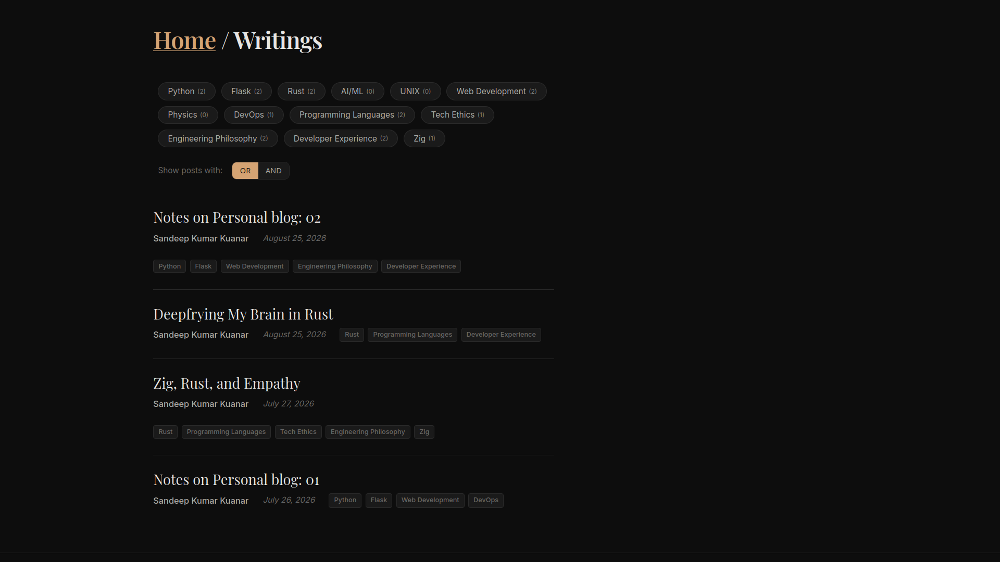
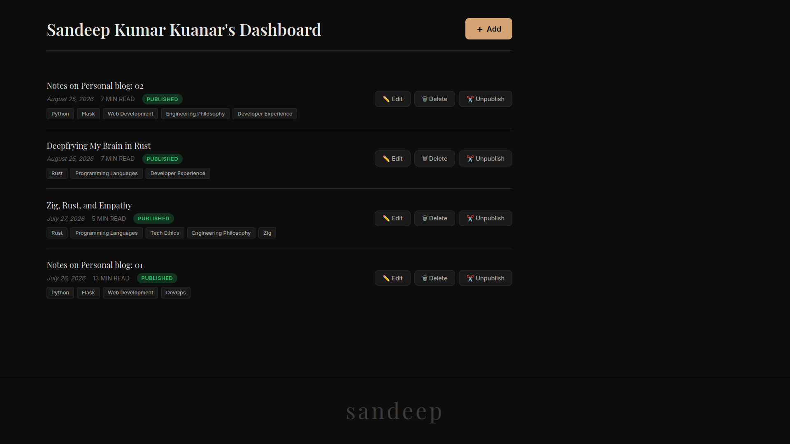
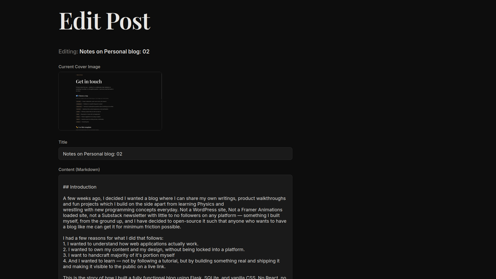
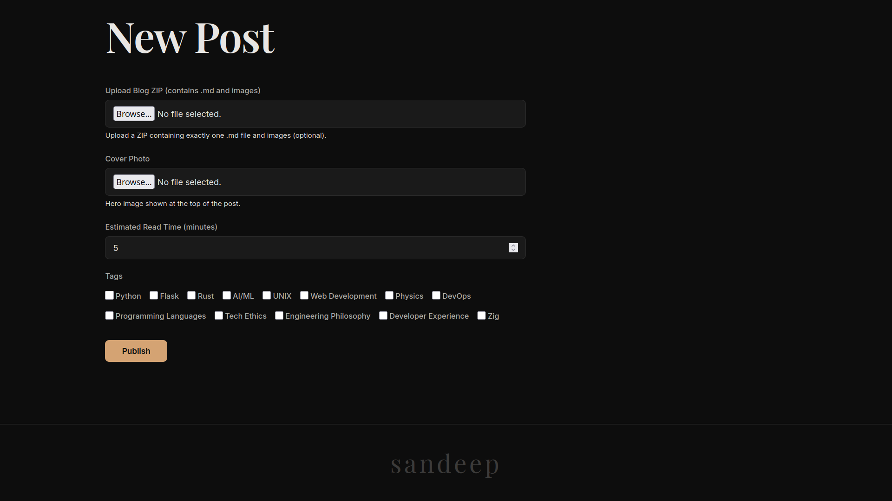

# Personal Blog Starter

[](https://www.python.org/)
[](https://flask.palletsprojects.com/)
[](https://opensource.org/licenses/MIT)
[](https://github.com/SandeepKumarKuanar/personal-blog/releases)

A fully-featured personal blog built with Flask, SQLite, and vanilla CSS. Write posts in Markdown, upload them as ZIP bundles, and publish instantly — no third‑party platforms, no lock‑in. Just your content, your design, and your server.
- 🔗 **Live Demo:** [sandeepkumarkuanar.pythonanywhere.com](https://sandeepkumarkuanar.pythonanywhere.com)
- 🔗 **Notes on the project:** [Notes on Personal blog](https://sandeepkumarkuanar.pythonanywhere.com/writings/1)
- 🔗 **Partly inspired by:**
  1. [personal blogging site](https://roadmap.sh/projects/personal-blog)
  2. [basic HTML website](https://roadmap.sh/projects/basic-html-website)
  3. [personal portfolio](https://roadmap.sh/projects/portfolio-website)

---
## 📸 Screenshots






## ✨ Features

- **ZIP-based publishing** – Write in Markdown, bundle images, upload a ZIP, and the blog parses, renders, and displays your post automatically
- **Markdown to HTML** – Uses `markdown2` with syntax highlighting via `pygments`
- **Tag system** – Add, filter, and combine tags with OR/AND logic
- **Admin dashboard** – Create, edit, publish, unpublish, and manage posts
- **User authentication** – Login, registration, and role‑based access (admin / regular user)
- **Custom error pages** – 404, 403, and 500 pages that match your design
- **Dark theme** – Clean, custom CSS with no external frameworks
- **Analytics ready** – Built‑in PostHog integration (optional)
- **Deployment ready** – Designed to run on PythonAnywhere
- **Full CRUD** – Complete Create, Read, Update, Delete workflow for posts
- **Share dropdown** – Share posts on X (Twitter) and LinkedIn, or copy the link with UTM tracking
- **Open Graph tags** – Dynamic meta tags for rich social media previews
- **Contact page** – Dedicated page with email tagging system and copy‑paste template

---

## 🧰 Tech Stack

| Layer | Technology |
|-------|------------|
| **Backend** | Flask 3.1.3 |
| **Database** | SQLite with SQLAlchemy ORM |
| **Authentication** | Flask‑Login + Flask‑Bcrypt |
| **Forms** | Flask‑WTF |
| **Markdown** | markdown2 + pygments |
| **Analytics** | PostHog (optional) |
| **Frontend** | Vanilla CSS + JavaScript |
| **Deployment** | PythonAnywhere / Gunicorn / WSGI |
| **Package Manager** | uv |

---

## 📁 Project Structure (subject to precise changes)

```
personal-blog/
├── app/
│   ├── __init__.py          # Flask app factory, extensions, PostHog setup
│   ├── forms.py             # WTForms definitions (Login, Register, Post, Admin, Edit)
│   ├── models.py            # SQLAlchemy models (User, Post, Tag)
│   ├── routes.py            # All route handlers (CRUD, share, dashboard)
│   ├── utils.py             # ZIP extraction, Markdown rendering, image rewriting
│   ├── static/              # CSS, JS, and uploaded assets
│   │   ├── style.css        # ~1200 lines of custom dark theme
│   │   ├── pygments.css     # Syntax highlighting theme
│   │   ├── js/
│   │   │   ├── tags.js      # Tag cloud filtering logic
│   │   │   └── share.js     # Share dropdown functionality (Copy, X, LinkedIn)
│   │   ├── post_images/     # Images extracted from blog ZIPs
│   │   └── post_covers/     # Blog cover images
│   └── templates/           # Jinja2 templates
│       ├── layout.html      # Base template with Open Graph tags
│       ├── home.html        # Landing page with bio
│       ├── blogs.html       # Writings listing with tag cloud
│       ├── post.html        # Individual post view with share dropdown
│       ├── dashboard.html   # Admin post management (Edit/Delete buttons)
│       ├── admin_new_post.html  # ZIP upload form
│       ├── edit_post.html   # Edit post form (Markdown, tags, read time)
│       ├── contact.html     # Contact page with email tagging system
│       ├── login.html / register.html
│       └── errors/          # 404, 403, 500 pages
├── instance/
│   └── site.db              # SQLite database (not tracked in Git)
├── main.py                  # Entry point
├── pyproject.toml           # Project metadata and dependencies
├── .env.example             # Environment variables template
└── README.md
```

---

## 🚀 Getting Started

### Prerequisites

- Python 3.10+
- [uv](https://docs.astral.sh/uv/) (recommended) or `pip`

### Installation

1. **Clone the repository**

```bash
git clone https://github.com/SandeepKumarKuanar/personal-blog.git
cd personal-blog
```

2. **Create and activate a virtual environment**

```bash
uv venv
source .venv/bin/activate   # On Windows: .venv\Scripts\activate
```

3. **Install dependencies**

```bash
uv sync
```

4. **Set up environment variables**

Copy the example environment file and fill in your values:

```bash
cp .env.example .env
```

Edit `.env` with your PostHog credentials (optional — the app will work without them):

> **Note:** The `.env` file is not tracked in Git. See `.env.example` for all available variables.

```
POSTHOG_PROJECT_TOKEN=your-posthog-project-token
POSTHOG_HOST=https://us.i.posthog.com
```

5. **Initialize the database**

```bash
uv run python -c "
from app import app, db
with app.app_context():
    db.create_all()
    print('Database created successfully!')
"
```

6. **Create an admin user**

```bash
uv run python -c "
from app import app, db
from app.models import User
from flask_bcrypt import Bcrypt
bcrypt = Bcrypt()
with app.app_context():
    hashed = bcrypt.generate_password_hash('your-password').decode('utf-8')
    admin = User(
        username='Your Name',
        email='your@email.com',
        password=hashed,
        is_admin=True
    )
    db.session.add(admin)
    db.session.commit()
    print('Admin user created!')
"
```

7. **Run the development server**

```bash
uv run python main.py
```

Visit `http://127.0.0.1:5000` to see your blog.

---

## 📝 Publishing a Post

1. Write your post in Markdown (`##` for headings, ` ```python ` for code blocks)
2. Place any images in the same folder as the `.md` file
3. Zip the folder (make sure the `.md` file is at the root of the ZIP)
4. Log in as admin and go to **Dashboard → + Add**
5. Upload the ZIP, add a cover image, select tags, and hit **Publish**

The system will:
- Extract the Markdown and images
- Parse the first `#` line as the title
- Rewrite image paths to `/static/post_images/<post_id>/`
- Render the Markdown to HTML with syntax highlighting
- Store both the raw Markdown and the rendered HTML

## ✏️ Editing a Post

1. Log in as admin and go to **Dashboard**
2. Click the **Edit** button next to the post you want to modify
3. Update the title, Markdown content, tags, or read time
4. Click **Update Post** — the HTML is automatically re‑rendered from the Markdown

> **Note:** Inline images are preserved and don't need to be re‑uploaded during edits.

## 🗑️ Deleting a Post

1. Log in as admin and go to **Dashboard**
2. Click the **Delete** button next to the post you want to remove
3. Confirm the deletion — the post and its associated images are permanently removed

## 🔗 Share Dropdown

Each post includes a share dropdown with three options:
- **Copy Link** – copies the post URL with UTM tracking parameters
- **Share on X** – opens X (Twitter) with a pre‑filled post
- **Share on LinkedIn** – opens LinkedIn with a rich preview using Open Graph tags

The Open Graph tags are dynamic — each post generates its own title, description, and URL for social sharing.

## ❓ FAQ

**Q: How do I add a new tag?**
A: Run the command in the "Adding Tags" section above, or use the admin dashboard.

**Q: Can I change the theme colors?**
A: Yes — edit the CSS variables in `app/static/style.css`.

**Q: How do I deploy this to a custom domain?**
A: Update the `SERVER_NAME` in `app/__init__.py` and configure your DNS.

---

## 🎨 Customization

### CSS

All styles are in `app/static/style.css`. The design uses CSS custom properties (variables) for easy theming:

```css
:root {
  --bg-primary: #0d0d0d;
  --text-primary: #e8e6e3;
  --accent: #d4a373;
  /* ... */
}
```

### Adding Tags

Tags are managed manually in the database. To add a new tag:

```bash
uv run python -c "
from app import app, db
from app.models import Tag
with app.app_context():
    db.session.add(Tag(name='Your Tag'))
    db.session.commit()
"
```

### Analytics

The blog includes PostHog integration. To enable it:
1. Sign up at [PostHog](https://posthog.com)
2. Get your project API token, and let the bot run and do changes
3. Add it to your `.env` file
4. Restart the server

---

## 🚢 Deployment

### PythonAnywhere

1. Clone the repository on PythonAnywhere
2. Set up a virtual environment and install dependencies
3. Configure the WSGI file to point to `main.py`
4. Set environment variables in the Web tab or via a `.env` file
5. Set up static file mappings: `/static/` → `/path/to/app/static/`
6. Reload the web app

## 🧪 Testing

There is currently no test suite, but you can verify the system by:

1. Creating a test post via the dashboard
2. Checking that images render correctly
3. Testing tag filtering with OR/AND modes
4. Verifying that unpublished posts are hidden from public view

---

## 🤝 Contributing

Contributions are welcome! If you find a bug or have an idea for an improvement:

1. Fork the repository
2. Create a feature branch (`git checkout -b feature/amazing-feature`)
3. Commit your changes (`git commit -m 'Add amazing feature'`)
4. Push to the branch (`git push origin feature/amazing-feature`)
5. Open a Pull Request

Please ensure your code follows the existing style and includes appropriate documentation.

---

## 📄 License

This project is open source and available under the [MIT License](LICENSE).

---

## 🙏 Acknowledgments

- [Corey Schafer](https://www.youtube.com/@coreyms) – Flask tutorial series that started it all
- [Dr. Charles Severance](https://www.dr-chuck.com/) – For inspiring the journey into programming
- The [Flask](https://flask.palletsprojects.com/), [SQLAlchemy](https://www.sqlalchemy.org/), and [PostHog](https://posthog.com/) communities
- [PostHog](https://posthog.com) – Analytics integration for understanding readers
- [roadmap.sh](https://roadmap.sh/dashboard) - For inspiring the implementations of this project

---

## 📬 Contact

- **From Blog:** [Custom Email based contact page](https://sandeepkumarkuanar.pythonanywhere.com/contact)
- **GitHub:** [SandeepKumarKuanar](https://github.com/SandeepKumarKuanar)
- **X:** [@kuanar_sandeep](https://x.com/kuanar_sandeep)
- **Email:** `kuanarsandeepkumar@gmail.com`

---
Built with curiosity, empathy, and intent. 🚀
